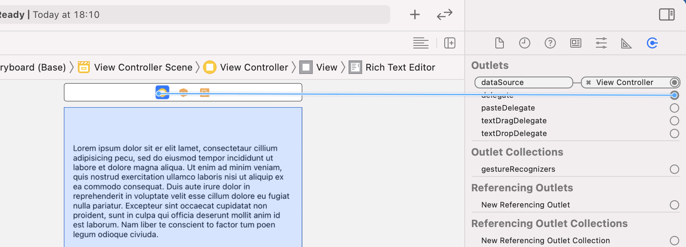
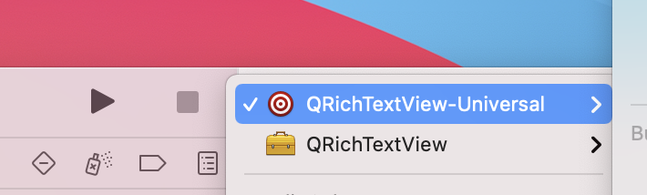
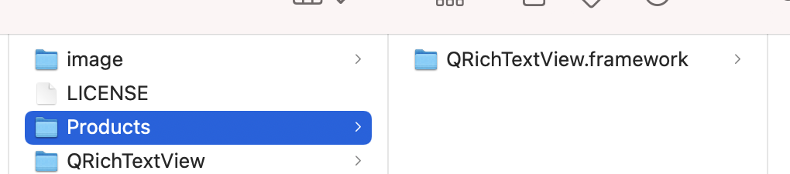

# QRichTextView
Richtext view demo

## Use:
### Method 1:
1.  Add this line into Podfile: pod 'QRichTextView'
1. Drag a UITextView into you viewcontroller.
1. Drag datasource & delegate:

### Method 2:

1. Change the project scheme target to QRichTextView-Universal and build:  

1. Drag QRichTextView.framework into your project, change to do not embed:  

Read more:
https://github.com/aryaxt/iOS-Rich-Text-Editor#readme

## License: 
MIT license.

